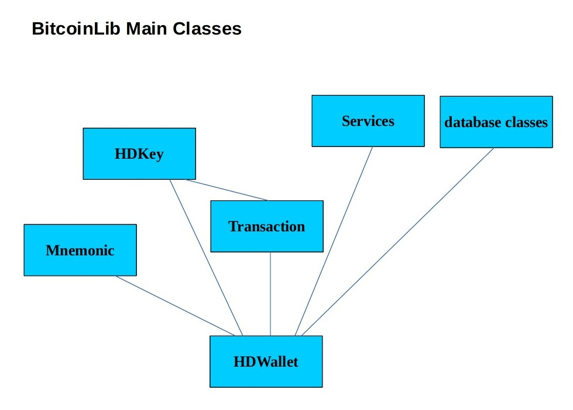

Classes Overview
================

These are the main Bitcoinlib classes

This is an overview of all BitcoinLib classes.

.. image:: ../_static/classes-overview-detailed.jpg

So most classes can be used individually and without database setup. The HDWallet class needs a proper database setup
and is dependent upon most other classes.