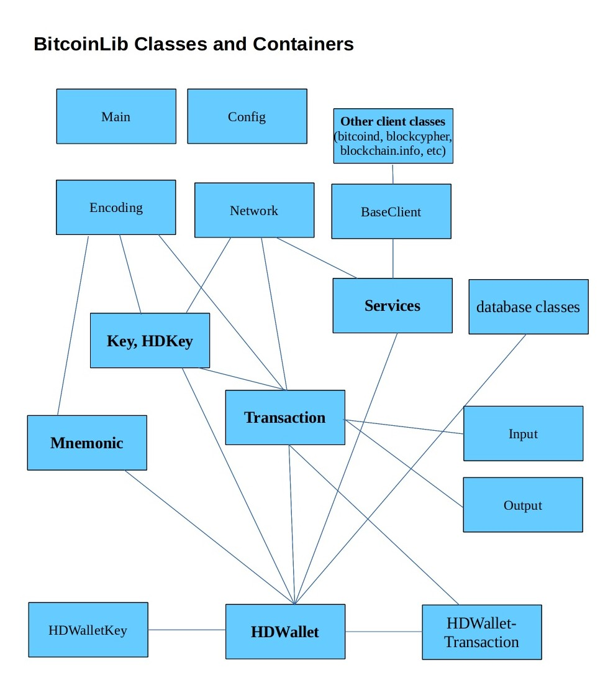

.. Bitcoinlib documentation master file, created by
   sphinx-quickstart on Sat Apr  8 10:06:16 2017.
   You can adapt this file completely to your liking, but it should at least
   contain the root `toctree` directive.

Welcome to Bitcoinlib's documentation!
======================================

.. toctree::
   :maxdepth: 2

   source/bitcoinlib.keys
   source/bitcoinlib.wallets
   source/bitcoinlib.networks
   source/bitcoinlib.mnemonic
   source/bitcoinlib.transactions
   source/bitcoinlib.services

   BitcoinLib modules <source/modules>

.. image:: _static/classes-overview.jpg

Indices and tables
==================

* :ref:`genindex`
* :ref:`modindex`
* :ref:`search`
